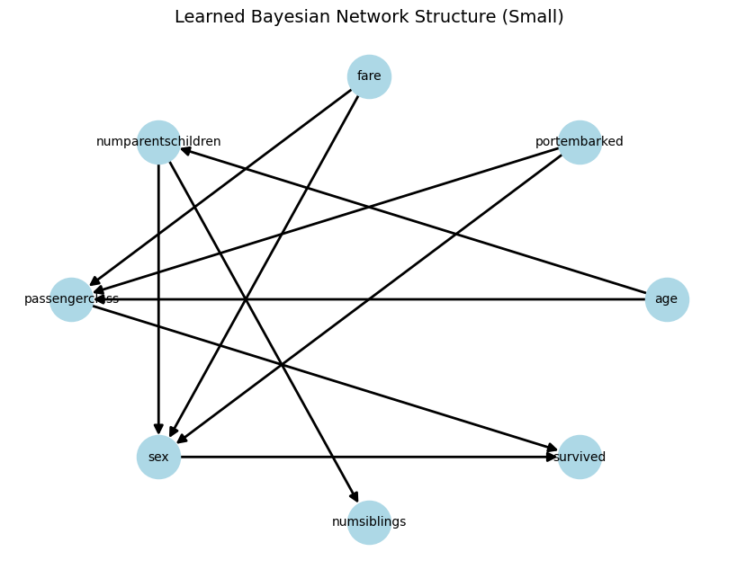
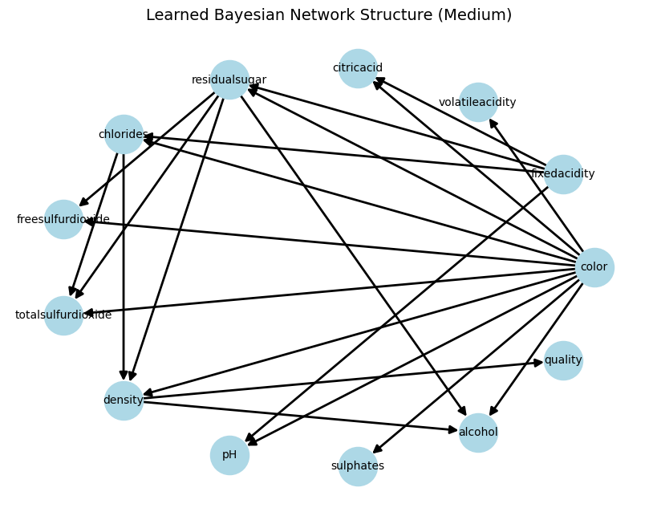
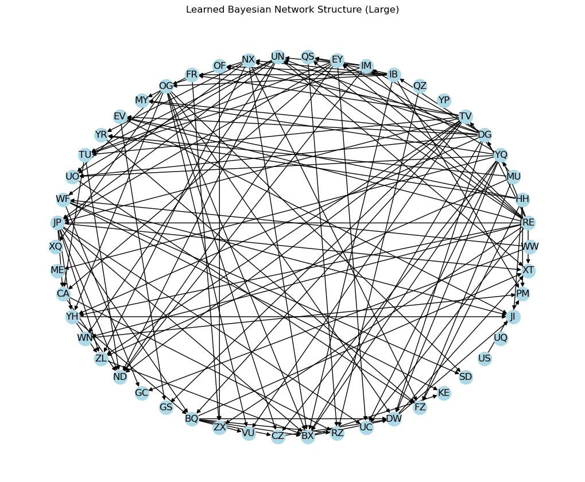

# Bayesian Network Structure Learning

## 1. Algorithm

The algorithm aims to find the optimal Bayesian Network for the given dataset.  
My search algorithm implements the K2 search method, which incrementally builds the network by adding edges that improve the Bayesian score.

### i. Preparation

I first generate a prior Dirichlet hyperparameter matrix \( \alpha_{ijk} \) for every node and initialize all entries to 1 using the `prior()` function.  
The `statistics()` function computes the observed counts \( M_{ijk} \) for each node instantiation given its parents.  
For each variable \( X_i \), I compute the individual log Bayesian score using `bayesian_score_component()` given its prior \( \alpha \) and observed counts \( M \).  
Finally, I sum all node scores to obtain the overall Bayesian score for the entire network structure \( G \) using `bayesian_score()`.

### ii. K2Search()

`K2Search()` requires a predefined variable ordering, which specifies the sequence in which nodes are processed.  
The algorithm begins by initializing an empty graph and then iteratively adds edges between nodes if doing so improves how well the model fits the data.  
For each variable \( X_i \):
- Only earlier variables in the ordering are considered as potential parents, which ensures that the structure never forms a loop.  
- The algorithm tests one possible parent edge at a time. It temporarily adds it and computes the updated Bayesian score.  
- If the score increases, the edge is kept, otherwise, it is removed.

This process repeats until no additional edge can further improve the network’s Bayesian score.

---

## 2. Resultsa

| Dataset | Runtime (s) | Bayesian Score |
|----------|-------------|----------------|
| small.csv  | 2.169   | -3840.82 |
| medium.csv | 103.315 | -100113.05 |
| large.csv  | 16525.142 | -430452.92 |

---

## 3. Graph

## 4. Code
import sys
import itertools
import pandas as pd
import numpy as np
from abc import ABC, abstractmethod
from scipy.special import loggamma
import networkx as nx

class Variable():
    def __init__(self, name: str, r: int):
        self.name = name
        self.r = r  # number of possible values

    def __str__(self):
        return "(" + self.name + ", " + str(self.r) + ")"

def write_gph(dag, idx2names, filename):
    with open(filename, 'w') as f:
        for edge in dag.edges():
            f.write("{}, {}\n".format(idx2names[edge[0]], idx2names[edge[1]]))

def prior(variables: list[Variable], graph: nx.DiGraph):
    '''genertaing a prior alpha ijk where all entries are 1, takes in a list of variables vars and strcture g'''
    n = len(variables)
    r = [var.r for var in variables]
    q = np.array([int(np.prod([r[j] for j in graph.predecessors(i)])) for i in range(n)])
    return [np.ones((q[i], r[i])) for i in range(n)]

def statistics(variables: list[Variable], graph: nx.DiGraph, data: np.ndarray):
    '''this is a function for extracting counts from data, assuming a Bayesian network w/ variable and structure G
    it returns an array M of length n. the ith component consists of a qi *ri matrix of counts'''
    n = len(variables)
    r = [var.r for var in variables]
    q = np.array([int(np.prod([r[j] for j in graph.predecessors(i)])) for i in range(n)])
    M = [np.zeros((q[i], r[i])) for i in range(n)] #number of datapoints
    for o in data.T:
        for i in range(n):
            k = int(o[i])  # Ensure integer
            parents = list(graph.predecessors(i))
            j = 0
            if len(parents) != 0:
                j = np.ravel_multi_index(o[parents].astype(int), [r[p] for p in parents]) #[r[p] for p in parents]
            M[i][j, k] += 1.0
    return M

def bayesian_score_component(M: np.ndarray, alpha: np.ndarray) -> float:
    '''log baysian score'''
    alpha_0 = np.sum(alpha, axis=1)
    p = np.sum(loggamma(alpha + M))
    p -= np.sum(loggamma(alpha))
    p += np.sum(loggamma(alpha_0))
    p -= np.sum(loggamma(alpha_0 + np.sum(M, axis=1)))
    return p

def bayesian_score(variables: list[Variable], graph: nx.DiGraph, data: np.ndarray) -> float:
    '''sum the p from bayesian_score_component'''
    n = len(variables)
    M = statistics(variables, graph, data)
    alpha = prior(variables, graph)
    return np.sum([bayesian_score_component(M[i], alpha[i]) for i in range(n)])

class DirectedGraphSearchMethod(ABC):
    @abstractmethod
    def fit(self, variables: list[Variable], data: np.ndarray) -> nx.DiGraph:
        pass

class K2Search(DirectedGraphSearchMethod):
    '''This variable ordering imposes a topological ordering in the resutlting graph'''
    def __init__(self, ordering: list[int]):
        self.ordering = ordering

    def fit(self, variables: list[Variable], data: np.ndarray) -> nx.DiGraph:
        graph = nx.DiGraph()
        graph.add_nodes_from(range(len(variables)))

        for k, i in enumerate(self.ordering[1:]):
            y = bayesian_score(variables, graph, data)
            
            while True:
                y_best, j_best = -np.inf, 0
                
                for j in self.ordering[:k]:
                    if not graph.has_edge(j, i):
                        graph.add_edge(j, i)
                        y_prime = bayesian_score(variables, graph, data)
                        if y_prime > y_best:
                            y_best, j_best = y_prime, j
                        graph.remove_edge(j, i)
                
                if y_best > y:
                    y = y_best
                    graph.add_edge(j_best, i)
                else:
                    break

        return graph

Below is implementation
csv_path = "/Users/zzze/Desktop/AA228/project1/data/large.csv"
df = pd.read_csv(csv_path)
remap = {}
X = pd.DataFrame()
for c in df.columns:
    uniq = sorted(pd.unique(df[c]))
    mapping = {v:i for i,v in enumerate(uniq)}
    remap[c] = mapping
    X[c] = df[c].map(mapping).astype(int)

variables = [Variable(c, X[c].nunique()) for c in X.columns]
idx2name = {i:v.name for i,v in enumerate(variables)}
data = X.to_numpy().T  

ordering = list(range(len(variables)))  
k2 = K2Search(ordering=ordering)
t0 = time.perf_counter()
graph = k2.fit(variables, data)
elapsed = time.perf_counter() - t0
score = bayesian_score(variables, graph, data)

out_path = Path(csv_path).with_suffix(".gph")
write_gph(graph, idx2name, str(out_path))

result = {
    "bayesian_score": float(score),
    "runtime_seconds": float(elapsed)
}

plt.figure(figsize=(10, 8))
pos = nx.circular_layout(graph)
nx.draw(
    graph,
    pos,
    with_labels=True,               
    labels=idx2name,           
    node_color="lightblue",         
    arrows=True
)

plt.title("Learned Bayesian Network Structure (Large)")
plt.axis("off")
plt.show()